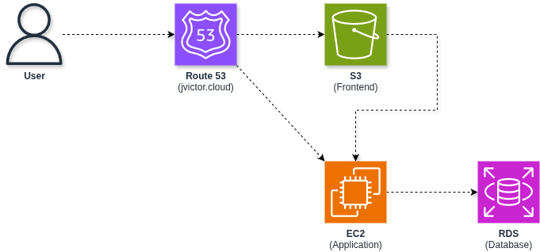

# Workshop AWS Student Builder Groups

Esse workshop consiste em apresentar conceitos básicos de **Cloud Computing** e fazer um overview sobre os principais conceitos sobre a **AWS**.

Ela consiste na implementação da arquitetura do slide "Arquitetura na prática":



A página um campo de texto para colocar o seu nome e tem um botão **"Fazer check-in na nuvem"**. Cada clique grava uma linha na tabela `checkins` do Postgres, e o contador mostra o total de check-ins.

## Estrutura

```text
.
├── backend/             # FastAPI + SQLAlchemy (Postgres)
│   ├── app/
│   │   ├── main.py      # rotas e CORS
│   │   ├── db.py        # conexão com o banco
│   │   └── models.py    # tabela checkins
│   ├── Dockerfile
│   ├── docker-compose.yml  # API (dev ou EC2)
│   ├── requirements.txt
│   └── .env.example
├── frontend/            # React + Vite + TypeScript
│   ├── src/
│   └── .env.example
├── scripts/
│   └── install.sh       # user data da EC2: Docker, Compose, Buildx e git
├── docs/                # imagens do README
└── docker-compose.yml   # Postgres local (dev)
```

## Requisitos

| Ferramenta | Versão |
| --- | --- |
| [Docker](https://docs.docker.com/get-docker/) + Docker Compose | 24+ |
| [Python](https://www.python.org/downloads/) | 3.12+ |
| [Node.js](https://nodejs.org/) + npm | 20.19+ ou 22.12+ |

## Como rodar o projeto localmente

### 1. Suba o banco (Postgres)

Na raiz do projeto:

```bash
docker compose up -d
```

Isso sobe o Postgres 17 em `localhost:5432` com usuário, senha e banco. Para conferir se está saudável:

```bash
docker compose ps
```

### 2. Rode o backend (FastAPI)

```bash
cd backend
python3 -m venv .venv
source .venv/bin/activate
pip install -r requirements.txt
cp .env.example .env
set -a && source .env && set +a
uvicorn app.main:app --reload --port 8000
```

A tabela `checkins` é criada sozinha quando a API sobe. Teste:

```bash
curl http://localhost:8000/health
curl -X POST http://localhost:8000/checkins
curl http://localhost:8000/checkins/count
```

A documentação interativa fica em <http://localhost:8000/docs>.

#### Alternativa: backend via Docker Compose

Se preferir não instalar Python, a pasta `backend/` tem um `docker-compose.yml` só da API:

```bash
cd backend
cp .env.example .env
```

No `.env`, troque `localhost` por `host.docker.internal` no `DATABASE_HOST` (de dentro do container, `localhost` é o próprio container) e defina `API_PORT=8000`:

```dotenv
DATABASE_HOST=host.docker.internal
API_PORT=8000
```

Depois:

```bash
docker compose up -d --build
docker compose logs -f api
```

### 3. Rode o frontend (React)

Em outro terminal:

```bash
cd frontend
npm install
cp .env.example .env
npm run dev
```

Abra <http://localhost:5173> e clique no botão.

### 4. Parar tudo

```bash
docker compose down        # para o banco (mantém os dados)
docker compose down -v     # para o banco e apaga os dados
```

## Variáveis de ambiente

### Backend (`backend/.env`)

| Variável | Descrição | Exemplo |
| --- | --- | --- |
| `DATABASE_HOST` | Host do Postgres (endpoint do RDS em produção) | `localhost` |
| `DATABASE_PORT` | Porta do Postgres | `5432` |
| `DATABASE_USER` | Usuário do Postgres | `sbg_user` |
| `DATABASE_PASSWORD` | Senha do Postgres | `sbg_password` |
| `DATABASE_NAME` | Nome do banco | `sbg` |
| `CORS_ORIGINS` | Origens liberadas no CORS, separadas por vírgula | `http://app.jvictor.cloud,http://localhost:5173` |
| `CHECKIN_RATE_LIMIT` | Rate limit por IP no `POST /checkins` | `30/minute` |
| `API_PORT` | Porta do host exposta pelo `backend/docker-compose.yml` | `80` (EC2) ou `8000` (dev) |

### Frontend (`frontend/.env`)

| Variável | Descrição | Exemplo |
| --- | --- | --- |
| `VITE_API_URL` | URL pública da API. É embutida no build. | `http://api.jvictor.cloud` |

## API

| Método | Rota | Descrição |
| --- | --- | --- |
| `GET` | `/health` | Health check |
| `GET` | `/checkins/count` | Total de check-ins |
| `POST` | `/checkins` | Cria um check-in e retorna `{ id, created_at, total }` |

### Rate limit

O `POST /checkins` é limitado por IP com [slowapi](https://github.com/laurentS/slowapi). Acima do limite, a API responde `429 Too Many Requests` e o front avisa o usuário.

- O limite é definido em `CHECKIN_RATE_LIMIT` (padrão `30/minute`). Outros formatos: `5/second`, `100/hour`.

> **Dica:** terminou o workshop? Apague a EC2, o RDS e o bucket para não ter surpresas na fatura.
